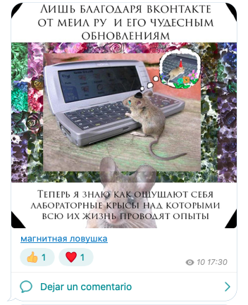
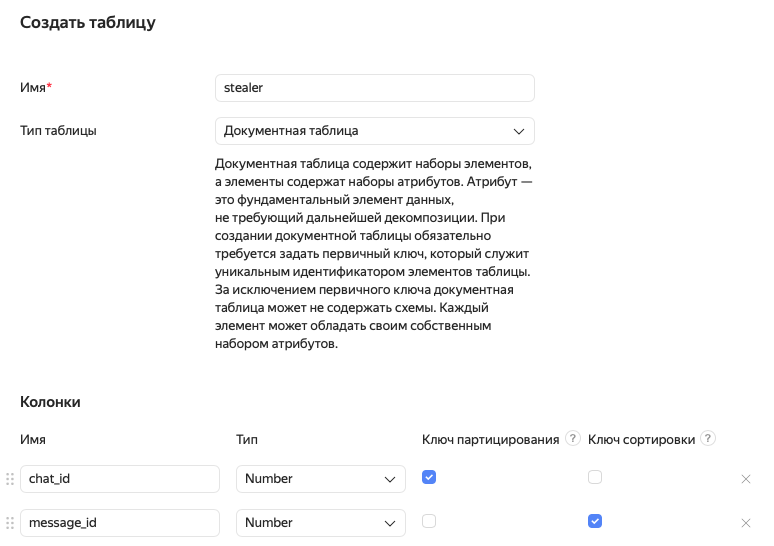
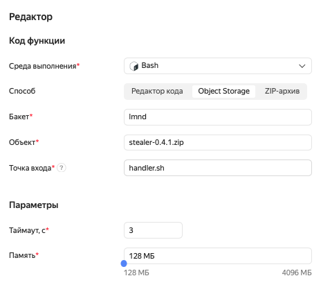

# Стилер

Телеграм-бот для непринужденного воровства контента с каналов. Копирует сообщения в каналы/чаты, стирая подписи и вставляя модную ссылку на канал. Постит по расписанию.



Призван быть бесплатным и стабильным, поэтому хостится на Яндекс-облаке. Содержит минимум интерфейса. 


Один бот обслуживает бесконечное количество каналов.

## Установка

### Телеграм

* Создайте бота в [Ботфазере](https://t.me/botfather). Выключите ему прайваси-мод в разделе «Груп прайваси» и разрешите постить в каналы.
* Создайте по админскому чату на каждый канал.
* Добавьте бота админом в каналы и в чаты.
* Зайдите в [веб-зет-версию](https://web.telegram.org/z/) и посмотрите айди каналов и чатов. Они будут в поле урла. К айди каналов при копировании надо добавлять 100 после минуса. Например, было -1678324636, стало -100678324636.

### [Яндекс-облако](https://cloud.yandex.ru)

1. Создайте сервисный аккаунт и статический ключ доступа.
2. Создайте функцию и сделайте ее публичной.
3. Создайте базу данных Уай-Дэ-Бэ и в ней документную таблицу с такими параметрами:
  
  Имя таблицы — ваше.
4. Создайте бакет в Обжект Сторедже и загрузите туда архив из [последнего релиза](https://github.com/tapochqa/stealer/releases/latest).
5. Создайте к функции по триггеру с крон-расписанием на каждый канал. Как делать крон-расписания, [рассказал Яндекс](https://cloud.yandex.ru/docs/functions/concepts/trigger/timer).
6. В редакторе функции распакуйте ее из загруженного архива:
  
  Название бакета — ваше.
7. Отредактируйте файл `handler.sh`. Первым аргументом впишите токен бота, вторым — параметры статического ключа доступа из п. 1 со ссылкой на размещение базы данных из п. 2, далее — данные каналов: айди канала, айди админского чата, айди нужного триггера, урл для модной ссылки. 
  Пример конфига:
```bash
#! /bin/bash

./stealer-Linux-x86_64 \
'2080542073:GeNIbT8k8PAOABJhr-grAjG51rWq0atkQ13' \
'{:access-key    "D4vYrYCDXukEoTMAOJxs8Eph0"
  :secret-key    "MYg62NMVSCu-bTJRBKWzs12NoJSeHMbNRaUJ1V4s"
  :endpoint      "https://docapi.serverless.yandexcloud.net/ru-central1/ikk16pbbc5q3l4qnhgi8/n4gu3sdpm02euij2taar"
  :region        "ru-central1"
  :table         "stealer"}' \
'{:chat-id       -1005000951886
  :admin-chat-id -5000824097
  :debug-chat-id nil
  :trigger-id    "aso44srv1u0e8b24iefm" 
  :caption-url   "https://t.me/rzhombic"}' \
'{:chat-id       -1005000317213
  :admin-chat-id -5000753504
  :debug-chat-id nil
  :trigger-id    "sm4r40a4iob28fs1eevu" 
  :caption-url   "https://t.me/mxmxsmsl"}'
```

### Мейк
Установите вебхук бота на функцию:
```bash
make set-webhook token="<Токен бота>" id="<Айди Яндекс-функции>"
```

## Пользование

Соберите админов в админском чате и склоните их пересылать туда сообщения. 

Бот будет регистрировать сообщения и постить их в канал по заданному расписанию. Без указания авторства и с перетертой на модную ссылку подписью.


## Сборка

Для сборки установите Лейнинген, Мейк и Докер.

```bash
docker pull ghcr.io/graalvm/native-image:22.2.0
make light-bash-package
```

Обертку апи Телеги и код для Яндекс функции придумал [Иван Гришаев](https://grishaev.me), а я тупо скопировал.

Макс.
